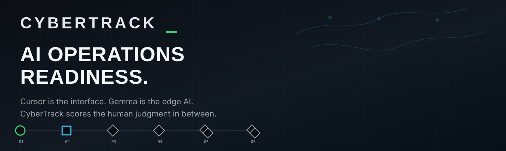

<p align="center">
  
</p>

# CyberTrack

**Call of Duty for AI Operations Readiness.**

CyberTrack is a training arena for AI operations readiness in defense,
emergency, and critical-infrastructure settings. Players solve timed technical
incidents inside Cursor using only local Gemma. The model can help, but some
missions plant bad guidance on purpose. Players score by checking the evidence,
catching the mistake, recovering, and making a defensible call.

Built for the **RAISE Summit Hackathon 2026 Google DeepMind Remote track**:
Edge / On-Device, best app running Gemma locally for offline, privacy-first
inference.

<p>
  <a href="HACKATHON_BUILD.md"><strong>Hackathon build log</strong></a>
  ·
  <a href="docs/build-status.md"><strong>Current build status</strong></a>
  ·
  <a href="DESIGN.md"><strong>Design system</strong></a>
</p>

## The Thesis

Most AI tools assume the cloud is available. Future operations will not.

Military, emergency, and critical-infrastructure teams will face moments where
connectivity is degraded, data is sensitive, and a frontier cloud model is not
available or appropriate. The human still has to reason, verify, and act.

CyberTrack simulates that edge condition. The available AI is local, smaller,
and sometimes wrong. The player has to use it without being used by it.

This is not a recruiting tool or a hiring screen. It is a practice environment
for the human-AI judgment future operations will require.

## How It Works

| Surface | Role |
|---|---|
| **Cursor** | The cockpit. Players read files, inspect evidence, use Cursor Chat, and edit mission artifacts. |
| **Local Gemma via Ollama** | The constrained edge AI. It can help, but it can also be confidently wrong. |
| **`cybertf` engine** | Starts timed runs, queries local Gemma, records evidence, scores submissions, and generates AARs. |
| **Local web arena** | Mission board, callsigns, leaderboard, ranks, mission records, and AAR views. |

Mission loop:

1. Pick a mission.
2. Inspect synthetic evidence in Cursor.
3. Ask local Gemma for help.
4. Verify or reject the model's hypothesis.
5. Submit a decision with cited evidence.
6. Read the after-action report and update the leaderboard.

## What It Measures

CyberTrack scores the human-AI skills that matter when the model is useful,
local, and not fully trustworthy:

- **Evidence discipline:** did you cite the files that prove the claim?
- **Model skepticism:** did you catch the planted bad guidance?
- **Recovery:** did you correct course after the model misled you?
- **Decision quality:** was the final call right and defensible?
- **Local compliance:** did the run use local Gemma instead of cloud AI?

Scoring is deterministic and reproducible from run artifacts. No model grades
the player.

## What Is Included

- Local Gemma-powered mission loop via Ollama.
- Six Season One missions with timed sprints, field events, relay work, and a
  marathon incident.
- Deterministic scoring, suspicious-time flagging, XP, ranks, and local season
  scorecards.
- After-action reports showing what held up and where reasoning broke.
- Next.js local web arena with mission board, leaderboard, callsigns, operator
  profiles, and AAR pages.
- Static brand assets in `assets/`, including the CyberTrack README banner and
  wordmark.

## Quickstart

Requirements:

- Python 3.10+
- Node.js 20+
- [Ollama](https://ollama.com)
- A local Gemma model, for example `ollama pull gemma4`
- Cursor for the intended cockpit workflow

From the repo root:

```bash
# Create an isolated Python env
python3 -m venv .venv
source .venv/bin/activate

# Install the CyberTrack CLI
pip install -r requirements.txt

# Install the local web arena
cd web
npm install
cd ..

# Prove local Gemma is serving
cybertf verify-model

# Pick a callsign
cybertf enlist NIGHTOWL

# See the mission board
cybertf list

# Start the local arena in another terminal
cd web
npm run dev
```

Open [http://localhost:3000](http://localhost:3000), then return to the repo
root for mission play:

```bash
source .venv/bin/activate

# Start Basic Qualification
cybertf run basic_qualification
cybertf brief basic_qualification

# Ask local Gemma about evidence
cybertf ask "How do I verify a claim about relay coverage?" \
  --file challenges/basic_qualification/data/relay_roster.txt

# Fill in the generated answer artifact, then submit
cybertf submit basic_qualification runs/<run_id>/answer.json

# Read the after-action report
cat runs/<run_id>/aar.md

# Generate the offline leaderboard
cybertf season

# Publish to the local arena
CYBERTF_ARENA_URL=http://localhost:3000 cybertf publish <run_id>
```

## Web Arena

You can also run the arena directly:

```bash
cd web
npm install
npm run dev
```

Then open [http://localhost:3000](http://localhost:3000).

The web arena is a local demo scoreboard, not the source of truth. The durable
record is the run folder and local season scorecard.

## Season One Missions

| Mission | Type | What it trains |
|---|---|---|
| Basic Qualification | Tutorial | Cockpit basics, local-model verification, catching a bad AI claim |
| Signal Lost | Sprint | Log triage, root-cause evidence vs. a tempting false lead |
| Prompt Under Fire | Field | Critiquing AI plans, hallucinated tools, and unsafe steps |
| Patch the Edge Agent | Field | Minimal bug fixes under constraint and test-driven recovery |
| Relay: Human + Gemma Handoff | Relay | Writing handoffs a constrained model can actually execute |
| Marathon: Degraded Comms | Marathon | Reconciling conflicting evidence and rejecting confident bad AI advice |

Missions are data-driven packs under `challenges/`. See
[docs/MISSION_DESIGN.md](docs/MISSION_DESIGN.md) for authoring notes.

## Project Map

```text
assets/        README banner and static CyberTrack wordmark
cybertf/       mission engine: CLI, Gemma client, scoring, AAR, telemetry
challenges/    Season One mission packs with synthetic evidence
web/           Next.js arena: mission board, leaderboard, profiles, AAR views
runs/          local run artifacts, gitignored
docs/          architecture, mission design, telemetry, roadmap, build status
DESIGN.md      product design system
HACKATHON_BUILD.md   what was built during the hackathon
```

## Safety And Boundaries

CyberTrack is training feedback only. It is not hiring, recruiting, screening,
or job-suitability scoring. All scenarios are synthetic and defensive. No live
targets, no offensive content.

Telemetry is opt-in, local, and workspace-scoped: mission timestamps,
`cybertf ask` prompts/responses, submissions, and scores. No keystrokes, no
mouse tracking, no browser history, and nothing outside this repo. Details:
[docs/TELEMETRY.md](docs/TELEMETRY.md).

Expected answers are stored as salted SHA-256 hashes, so this public repo
contains no plaintext answer keys. That is the honest demo validation tier.
Production seasons should move validation server-side.

## License

MIT. See [LICENSE](LICENSE).
